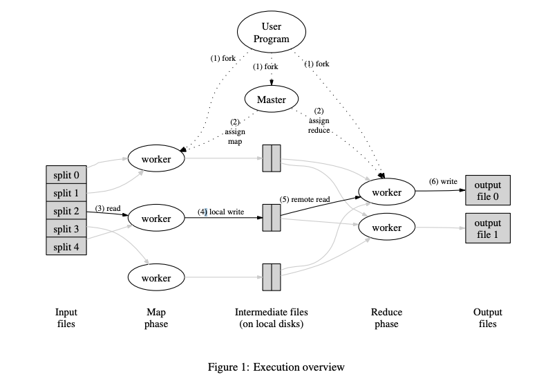

# 6.824 Lab1: MapReduce
## 什么是MapReduce
MapReduce 是由 Google的 Jeff Dean 和 Sanjay在 [MapReduce 论文](https://static.googleusercontent.com/media/research.google.com/en//archive/mapreduce-osdi04.pdf)中提出一个软件架构，它是用于处理大量数据在分布式集群上并行处理的实现。


### Map Reduce
Map 函数的作用是将输入的文件经过处理后，生成key-value pairs，以 golang 举例子，就是下面的 Output。Output 的数据会存入到中间文件(intermediate files)中。
```go
type KVPair struct {
    Key string
    Value string
}

type Output []KVPair
```
Reduce 函数的作用，是根据从中间文件获得的 KVPair 来计算得到最后的结果。

以上图举例，Map 处理的过程如下
```bash
{split0} ---- Map -----> [{a, 1}, {b, 1}, {c, 1}]
{split1} ---- Map -----> [{b, 1}, {d, 1}]
...
{splitN} ---- Map -----> [{a, 1}, {a, 1}, {c, 1}, {c, 1}]
```
 Ruduce 的过程如下
```bash
[{a, 1}, {a, 1}, {a, 1}] ---- Reduce ----> 3
[{b, 1}, {b, 1}] ---- Reduce ----> 2
[{c, 1}, {c, 1}, {c, 1}] ---- Reduce ----> 3
[{d, 1}] --- Reduce ---->  1
```

Map 函数的入参为 一个 key 和一个 value，其中 key 一般为文件名，可以忽略，没用太大作用，value 则是文件的内容。
Reduce 函数的入参是 一个 key 和 key对应的一系列 value。

### Master & Worker
Master 负责分配任务，Worker每次从 Master 获取任务，执行完成后汇报给 Master 完成情况。当 Map 任务都完成后，Master 再分配 Reduce 任务。

## Lab1
### 关于调试代码
我的环境是 ARM 的 MacOS，golang 版本是 1.19.4

代码结构（简化）
```bash
.
├── Makefile
└── src
    ├── go.mod
    ├── go.sum
    ├── kvraft
    │   └──*.go
    ├── labgob
    │   ├── labgob.go
    │   └── test_test.go
    ├── labrpc
    │   └── *.go
    ├── main
    │   ├── build.sh
    │   ├── *.go
    │   ├── *.txt
    │   ├── test-mr-many.sh
    │   └── test_mr.sh
    ├── models
    │   └── kv.go
    ├── mr
    │   └── *.go
    ├── mrapps
    │   ├── *.go
    │   └── *.so
    ├── porcupine
    │   └── *.go
    ├── raft
    │   └── *.go
    ├── shardctrler
    │   └── *.go
    └── shardkv
        └── *.go

```
测试脚本（节选） `./src/main/test_mr.sh`
```bash
RACE=-race  
  
if \[\[ "$OSTYPE" = "darwin"\* \]\]  
then  
 if go version | grep 'go1.17.\[012345\]'  
   then  
   \# -race with plug-ins on x86 MacOS 12 with  
 # go1.17 before 1.17.6 sometimes crash.   RACE=  
    echo '\*\*\* Turning off -race since it may not work on a Mac'  
   echo '    with ' `go version`  
   fi  
fi
# run the test in a fresh sub-directory.  
rm -rf mr-tmp  
mkdir mr-tmp || exit 1  
cd mr-tmp || exit 1  
rm -f mr-*  
  
# make sure software is freshly built.  
(cd ../../mrapps && go clean)  
(cd .. && go clean)  
(cd ../../mrapps && go build $RACE -buildmode=plugin wc.go) || exit 1  
(cd ../../mrapps && go build $RACE -buildmode=plugin indexer.go) || exit 1  
(cd ../../mrapps && go build $RACE -buildmode=plugin mtiming.go) || exit 1  
(cd ../../mrapps && go build $RACE -buildmode=plugin rtiming.go) || exit 1  
(cd ../../mrapps && go build $RACE -buildmode=plugin jobcount.go) || exit 1  
(cd ../../mrapps && go build $RACE -buildmode=plugin early_exit.go) || exit 1  
(cd ../../mrapps && go build $RACE -buildmode=plugin crash.go) || exit 1  
(cd ../../mrapps && go build $RACE -buildmode=plugin nocrash.go) || exit 1  
(cd .. && go build $RACE mrcoordinator.go) || exit 1  
(cd .. && go build $RACE mrworker.go) || exit 1  
(cd .. && go build $RACE mrsequential.go) || exit 1
```
我们可以看到，执行目录是在 `./src/main/mr-tmp`
lab1使用了 go 的 plugin 功能，先将不同的 map reduce 「函数对」编译成 `xxxx.so`插件，之后的MapReduce 框架的可执行文件只需要在运行时传入指定的 so 文件路径，就可以加载其中的 map 和 reduce 函数，以达到一次编译多个功能。只要 so 文件中的 map 和 reduce 的函数签名对应即可。

在使用 goland 调试用了 plugin 功能的代码时，我发现 goland 会报错。在查阅资料后，得知，在 build 时需要开启`-gcflags "all=-N -l"`选项，并且不能开启 `-race` 选项，否则会出现报错。
那么，在编译 so 插件时，我们应当用如下的命令。
`(cd ../../mrapps && go build  -gcflags "all=-N -l" -buildmode=plugin wc.go)`
编译可执行文件时，也要用相同的 build 选项。
`(cd .. && go build -gcflags "all=-N -l" mrworker.go)`

如果调试的程序并没有用 plugin 功能，那么不需要在意这些 build 选项，使用脚本里的就行。

### Master 设计
Master 负责分发任务，当有 Worker 向 Master 请求分配任务时，对请求作出响应。Master 在启动时入参为 M 个输入文件，Reduce 数量 R。

任务的种类分为 Map 和 Reduce 两种。我们让 Master 有两个状态：Map 状态，Reduce 状态。不同的状态分配不同的任务。
Reduce 任务需要在 Map 任务都执行完之后进行。
总共有 M 个 Map 任务和 R 个 Reduce 任务。

每次 Worker 得到 Master 分配任务后，Master 将该任务标记为 running。Worker 执行完任务后，通知 Master，Master 此时再将该任务状态标记为 finished。

那么我们可以开启一个 goroutine 负责分配任务，它每间隔一段时间，检查当前 Master 状态下，各个任务的状态。当所有任务都完成时，切换 Master 状态，进入 Reduce 状态或者结束进程。

### Worker 设计
根据 Hint `* A reasonable naming convention for intermediate files is mr-X-Y, where X is the Map task number, and Y is the reduce task number.`
在执行 Map 任务时，Worker 要将 KVPair 存入中间文件，对 KVPair 的 Key 进行 hash 操作后对 R 取模，得到 Y，再根据分配的 Map 任务编号 X，存入到 mr-X-Y 文件中。
在执行 Reduce 任务时，Worker 根据分配的任务序号Y，读取所有的 Y 中间文件，经过 reduce 处理后，根据 Rules `* The worker implementation should put the output of the X'th reduce task in the file mr-out-X.`，Y 号 Reduce 任务的结果文件为 `mr-out-Y`。

Worker 的工作很简单，每次从通过 RPC 请求从 Master 获取任务，根据任务的种类执行对应的函数，完成后继续获取新的任务。

### 容错处理
在现实中，当集群中的节点够多时，肯定会出现某一节点在某一时刻出错的情况，它可能会在一段时间内无法通信。
如果没有容错处理，Master 会因为等待出错 Worker 反馈其被分配的任务的执行状态而无法进入下一状态。
分配任务时，记录下该任务分配的时刻。每次分配任务的 goroutine 执行时，遍历每个任务的状态，对于处于 running 状态的任务，根据记录的分配时刻，检查其是否超时，若超时，将重置该任务的状态为初始状态，后续 Worker 请求分配任务时，会被重新分配。

## 参考资料
1. http://nil.csail.mit.edu/6.824/2022/labs/lab-mr.html
2. https://static.googleusercontent.com/media/research.google.com/en//archive/mapreduce-osdi04.pdf